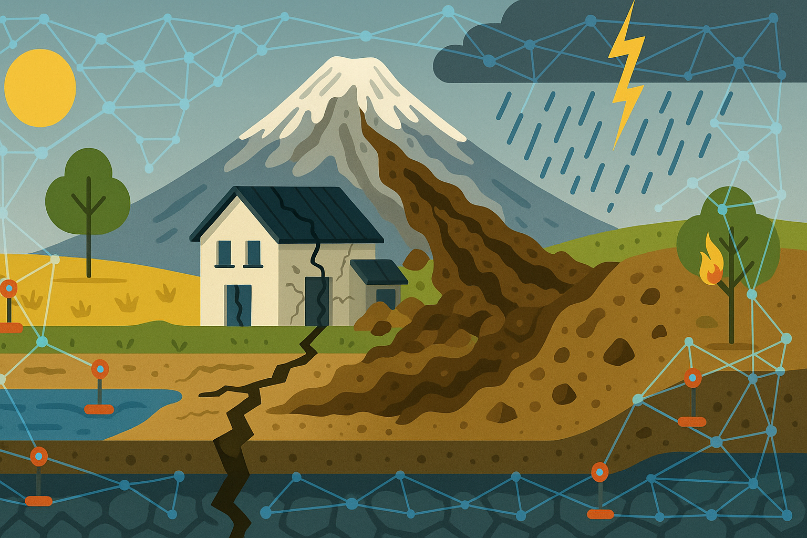

# Welcome to GAIA HazLab!



## Geospatial AI for Hazard Laboratory

GAIA HazLab is a comprehensive platform dedicated to advancing hazard assessment through the integration of machine learning, geospatial analytics, and data-driven approaches. Our mission is to provide researchers, practitioners, and stakeholders with the tools and resources necessary to understand, predict, and mitigate natural hazards.

## Platform Overview

This documentation is organized into five main sections:

### 🎯 [Problem Statement](chapters/problem_statement)
Understand the challenges and objectives in hazard assessment. We define the key research questions and goals that drive our platform development.

### 📊 [DataHub](chapters/datahub)
Access our centralized repository of hazard-related geospatial data. The DataHub provides datasets, data management tools, and documentation for working with hazard data.

### 🤖 [ModelHub](chapters/modelhub)
Explore our collection of machine learning models and algorithms designed for hazard prediction and analysis. Find pre-trained models, training pipelines, and model evaluation tools.

### 📈 [HazEvalHub](chapters/hazevalhub)
Utilize our frameworks and tools for evaluating hazard assessments. The HazEvalHub provides validation methodologies, metrics, and benchmarking capabilities.

### 📚 [Resources](chapters/resources)
Access additional resources including tutorials, references, publications, and community contributions.

## Getting Started

```{admonition} Quick Links
:class: seealso
* [GitHub Organization]({{ github_org_url }})
* [Website]({{ website_url }})
* [Documentation Repository]({{ github_org_url }}/{{ book_repo }})
```

## About

GAIA HazLab is developed and maintained by researchers at the University of Washington. Our goal is to make hazard assessment more accessible, accurate, and actionable through the power of AI and geospatial technologies.

## Contributing

We welcome contributions from the community! Please see our GitHub repository for guidelines on how to contribute to the platform.

## License

This project is licensed under the MIT License. See the LICENSE file in the repository for details.
